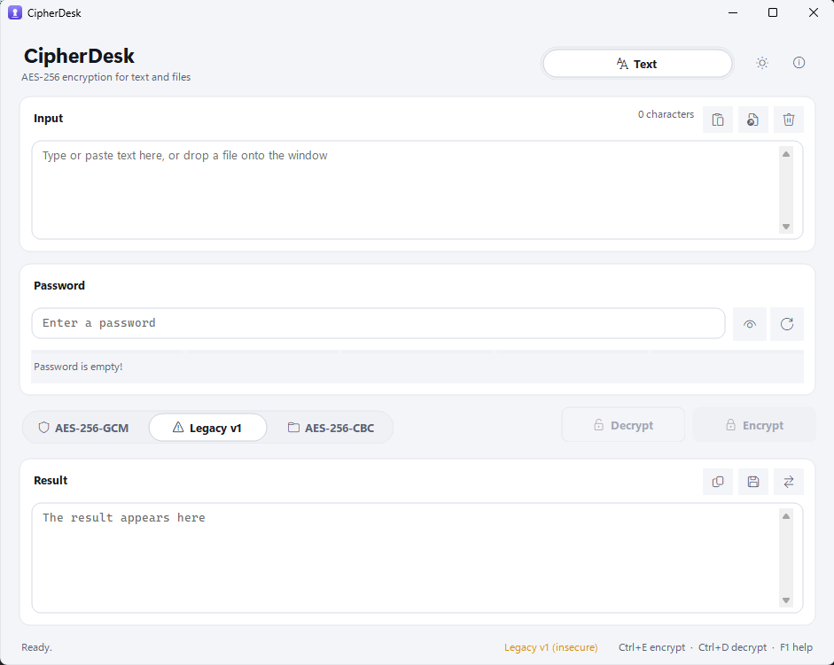
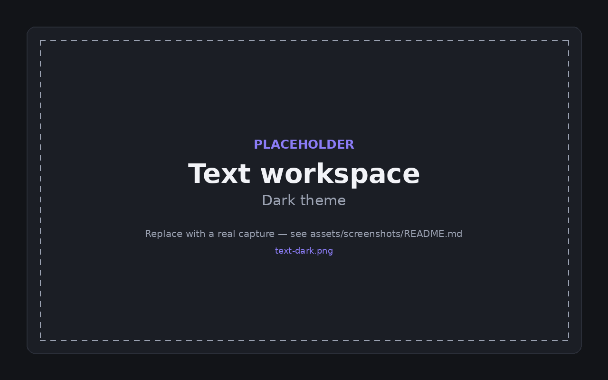
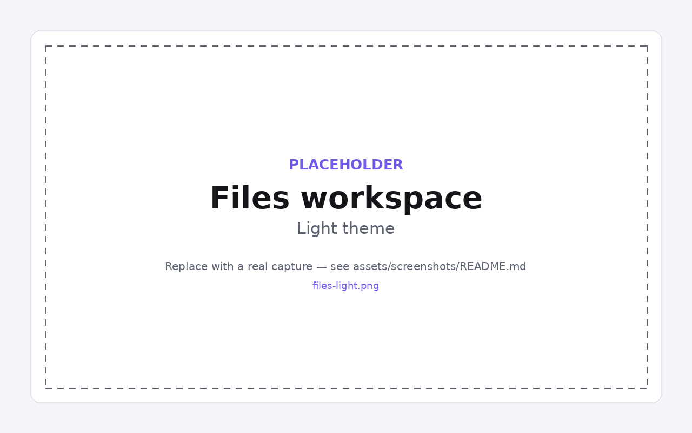
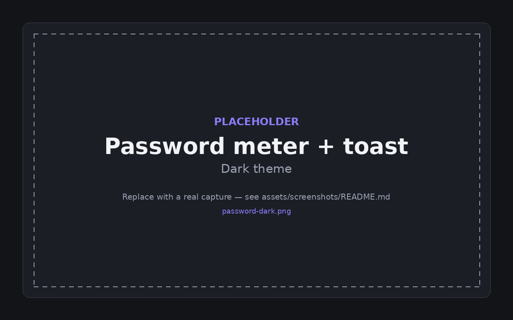

# CipherDesk

**A modern, offline Windows utility for encrypting text and files with AES-256-GCM, with AES-256-CBC and Legacy v1 compatibility.**

No cloud. No telemetry. No accounts. Your data stays on your machine.

[Download](#installation) · [Features](#features) · [Security](#security-model) · [Architecture](#architecture) · [Contributing](CONTRIBUTING.md)

---

## Screenshots

| Light | Dark |
|---|---|
|  |  |
|  |  |

---

## Features

### Encryption

* **AES-256-GCM** authenticated encryption for new data.
* **PBKDF2-HMAC-SHA256** key derivation with a configurable work factor and random salt.
* **Random nonce generation** for modern text encryption, preventing identical plaintexts from producing identical ciphertexts.
* **Authenticated headers** so important format parameters cannot be modified without detection.
* **Large-file support** with streaming encryption using authenticated chunks.
* **AES-256-CBC compatibility** for data produced by the original CBC-based implementation.
* **Legacy v1 compatibility** for reading older CipherDesk data.
* Clear separation between modern, CBC, and legacy encryption formats.

### Interface

* Modern Windows Forms interface with custom controls.
* Light and dark themes.
* Follow-the-system theme support.
* Themed Windows title bar using DWM.
* Per-monitor V2 high-DPI support.
* Responsive layouts built with nested `TableLayoutPanel`s.
* Toast notifications for routine operations.
* Drag and drop support for text and files.
* Live password-strength feedback.
* Built-in password generator.
* Copy, paste, clear, save, and use-result-as-input actions.
* Context menus and tooltips throughout the application.
* Status bar with operation feedback.

### Keyboard

| Shortcut            | Action                        |
| ------------------- | ----------------------------- |
| `Ctrl+E`            | Encrypt                       |
| `Ctrl+D`            | Decrypt                       |
| `Ctrl+Shift+C`      | Copy result                   |
| `Ctrl+O`            | Open file                     |
| `Ctrl+S`            | Save result                   |
| `Ctrl+L`            | Clear everything              |
| `Ctrl+T`            | Cycle theme                   |
| `Ctrl+1` / `Ctrl+2` | Switch between Text and Files |
| `F1`                | About and help                |

---

## Encryption Formats

CipherDesk currently supports three encryption formats.

### Modern

**AES-256-GCM** is the recommended format for all new encrypted data.

It provides authenticated encryption, meaning that ciphertext modifications are detected during decryption rather than producing silently corrupted plaintext.

Modern payloads use:

* AES-256-GCM
* PBKDF2-HMAC-SHA256
* Random per-payload salt
* Random nonce
* Authentication tag
* Versioned payload format
* Authenticated metadata

For files, encryption is performed as authenticated chunks so large files do not need to be loaded entirely into memory.

### CBC

CipherDesk also supports **AES-256-CBC** for compatibility with the original CBC-based implementation.

This format exists primarily to allow existing data to remain accessible.

CBC by itself does not provide authentication or integrity protection. It should therefore **not be preferred for newly encrypted data** when the modern AES-256-GCM format is available.

The application keeps CBC as an explicit compatibility format rather than silently selecting it for new encryption.

### Legacy v1

The original CipherDesk v1 format is retained for backward compatibility.

It used AES-256-CBC with:

* A fixed all-zero IV
* No salt
* No authentication
* No integrity protection
* An unsalted and unstretched password-derived key

The legacy format is cryptographically weak and should not be used for new data.

It remains available solely so existing encrypted data can be recovered and migrated.

If you have legacy data:

1. Decrypt it using the Legacy v1 format.
2. Select the Modern format.
3. Encrypt it again using AES-256-GCM.

---

## Installation

### Portable build

1. Download the latest `CipherDesk-win-x64.zip` from the [GitHub Releases](https://github.com/ahmadmahboubi/CipherDesk/releases/latest) page.
2. Extract the archive anywhere.
3. Run `CipherDesk.exe`.

The published build is self-contained, so the .NET runtime does not need to be installed separately.

### Requirements

|              |                                     |
| ------------ | ----------------------------------- |
| OS           | Windows 10 version 1809 or later    |
| OS           | Windows 11                          |
| Architecture | x64                                 |
| Runtime      | None for the self-contained release |

CipherDesk does not require an online account or cloud service.

Application settings are stored locally under:

```text
%APPDATA%\CipherDesk\settings.json
```

Settings contain UI preferences such as window size and theme. Passwords and encrypted content are not stored there.

---

## Build from Source

```bash
git clone https://github.com/ahmadmahboubi/CipherDesk.git
cd CipherDesk

dotnet restore
dotnet build -c Release
dotnet test

dotnet run --project src/CipherDesk.App
```

### Publish a Windows release

```bash
dotnet publish src/CipherDesk.App \
  -c Release \
  -r win-x64 \
  -p:PublishSingleFile=true \
  -p:SelfContained=true \
  -o artifacts/win-x64
```

Requires the .NET 8 SDK.

Visual Studio 2022 and JetBrains Rider can open `CipherDesk.sln` directly.

---

## Architecture

```text
CipherDesk.sln
├── src/
│   ├── CipherDesk.Core/             net8.0
│   │   ├── Abstractions/
│   │   │   ├── ITextCipher
│   │   │   └── IFileCipher
│   │   │
│   │   ├── Text/
│   │   │   ├── ModernTextCipher
│   │   │   ├── CbcTextCipher
│   │   │   ├── LegacyTextCipher
│   │   │   └── TextCipherRouter
│   │   │
│   │   ├── Files/
│   │   │   ├── FileCipher
│   │   │   └── CryptoProgress
│   │   │
│   │   ├── Passwords/
│   │   │   ├── PasswordStrength
│   │   │   └── PasswordGenerator
│   │   │
│   │   └── Internal/
│   │       ├── CipherHeader
│   │       ├── KeyDerivation
│   │       └── SecureBuffer
│   │
│   └── CipherDesk.App/              net8.0-windows
│       ├── Theming/
│       ├── Controls/
│       ├── Views/
│       ├── Dialogs/
│       ├── Services/
│       └── Forms/
│
└── tests/
    └── CipherDesk.Core.Tests/
```

The dependency direction is intentionally one-way:

```text
CipherDesk.App
       │
       ▼
CipherDesk.Core
```

The Core project has no dependency on Windows Forms and contains the encryption engine independently of the UI.

The UI communicates with the cryptographic layer through abstractions such as `ITextCipher` and `IFileCipher`.

`TextCipherRouter` is responsible for selecting the appropriate encryption format without containing cryptographic implementation details.

More architectural information is available in:

```text
docs/ARCHITECTURE.md
```

---

## Security Model

### What CipherDesk protects against

CipherDesk is designed to protect encrypted text and files from an attacker who obtains the encrypted output but does not know the password.

With the recommended AES-256-GCM format:

* The plaintext cannot be recovered without the password.
* Ciphertext modifications are detected.
* Authentication failures are rejected.
* Random salts prevent identical passwords from producing identical derived keys.
* Random nonces prevent identical plaintexts from producing identical ciphertexts.

### What CipherDesk does not protect against

#### Weak passwords

Encryption cannot compensate for a weak password.

A password such as:

```text
password123
```

is not made secure simply because AES-256 is used.

Use a strong, unique password. CipherDesk includes a password-strength indicator and password generator to make this less painful, because apparently humans enjoy making cryptography's strongest primitive irrelevant.

#### Compromised machines

CipherDesk cannot protect against:

* Keyloggers
* Malware
* Memory inspection
* Screen capture
* A compromised operating system
* Malicious software running under the same user account

If an attacker controls the machine while you are entering your password, encryption cannot save you.

#### Metadata

CipherDesk does not hide all metadata.

Depending on the format and operation, an observer may still learn information such as:

* Encrypted file size
* Approximate plaintext size
* The existence of encrypted data
* File names and filesystem metadata

#### Forgotten passwords

There is no password recovery mechanism.

If you lose the password, CipherDesk cannot recover the encrypted content for you.

That is intentional.

---

## Cryptographic Details

### Modern AES-256-GCM

| Property        | Implementation                  |
| --------------- | ------------------------------- |
| Cipher          | AES-256-GCM                     |
| Key size        | 256 bits                        |
| Key derivation  | PBKDF2-HMAC-SHA256              |
| Salt            | Random per payload              |
| Nonce           | Random for text payloads        |
| Authentication  | GCM authentication tag          |
| Header          | Versioned and authenticated     |
| File encryption | Authenticated chunked streaming |

The exact binary format is documented in:

```text
docs/FILE-FORMAT.md
```

### AES-256-CBC

The CBC compatibility format uses:

| Property       | Implementation                                     |
| -------------- | -------------------------------------------------- |
| Cipher         | AES-256-CBC                                        |
| Purpose        | Compatibility with the original CBC implementation |
| Authentication | None                                               |
| Integrity      | None                                               |
| IV             | Determined by the CBC compatibility format         |

Because CBC encryption does not inherently authenticate ciphertext, AES-256-GCM should be preferred for new data.

### Legacy v1

The original v1 format used AES-256-CBC with a fixed all-zero IV, no salt, no authentication, and an unsalted, unstretched password-derived key.

It is retained exclusively for backward compatibility.

Legacy compatibility is protected by dedicated tests containing known ciphertext vectors generated from an independent reference implementation.

---

## Testing

CipherDesk includes automated tests covering:

* Modern encryption/decryption round trips
* Large text payloads
* Randomized encryption output
* Wrong-password handling
* Ciphertext tampering
* Header tampering
* Truncated payloads
* Unsupported format versions
* Automatic modern-format detection
* CBC compatibility
* Legacy compatibility
* Known legacy ciphertext vectors
* Large file encryption
* File tampering
* File truncation
* Cancellation
* Progress reporting
* Temporary-file cleanup
* Suggested output paths

Run the test suite with:

```bash
dotnet test
```

---

## Technologies

|                |                                |
| -------------- | ------------------------------ |
| Language       | C#                             |
| Runtime        | .NET 8                         |
| UI             | Windows Forms                  |
| Cryptography   | `System.Security.Cryptography` |
| Modern cipher  | `AesGcm`                       |
| Key derivation | `Rfc2898DeriveBytes.Pbkdf2`    |
| Tests          | xUnit                          |
| CI             | GitHub Actions                 |

The application intentionally keeps runtime dependencies minimal.

The custom UI controls avoid introducing a third-party UI framework, keeping the application easier to audit, maintain, and modify.

---

## Why No Third-Party UI Framework?

CipherDesk uses custom WinForms controls instead of frameworks such as Guna UI or similar commercial UI libraries.

The reasons are straightforward:

* No additional runtime dependencies.
* No licensing concerns for an MIT project.
* Full control over the visual design.
* Better integration with Windows light/dark themes.
* Smaller deployment footprint.
* Easier long-term maintenance.
* No dependency on a third-party UI vendor.

The application is intentionally built from standard .NET and Windows APIs wherever practical.

---

## Roadmap

* [ ] Argon2id as an optional key derivation function
* [ ] Folder encryption with a manifest
* [ ] Command-line companion sharing `CipherDesk.Core`
* [ ] Localization
* [ ] Signed release binaries
* [ ] MSIX packaging
* [ ] Additional encryption-format documentation
* [ ] Expanded cross-platform Core test coverage

Ideas, bug reports, and pull requests are welcome.

See [CONTRIBUTING.md](CONTRIBUTING.md).

---

## Security Auditing

**CipherDesk has not been independently security audited.**

This project is intended as a practical desktop encryption utility and an open-source engineering project. It should not be treated as a substitute for independently audited security software in high-risk environments.

If you discover a potential security vulnerability, please read [SECURITY.md](SECURITY.md) before reporting it.

Do not publicly disclose sensitive vulnerabilities through regular GitHub issues.

---

## Acknowledgements

CipherDesk started as a small WinForms encryption/decryption utility.

The application architecture, user interface, and modern cryptographic layer have since been substantially rebuilt, while compatibility with older encrypted data has been intentionally preserved.

Maintaining backward compatibility matters: encrypted data should not become inaccessible simply because the application got better.

---

## License

MIT License

Copyright © CipherDesk contributors.

See [LICENSE](LICENSE) for the complete license text.
